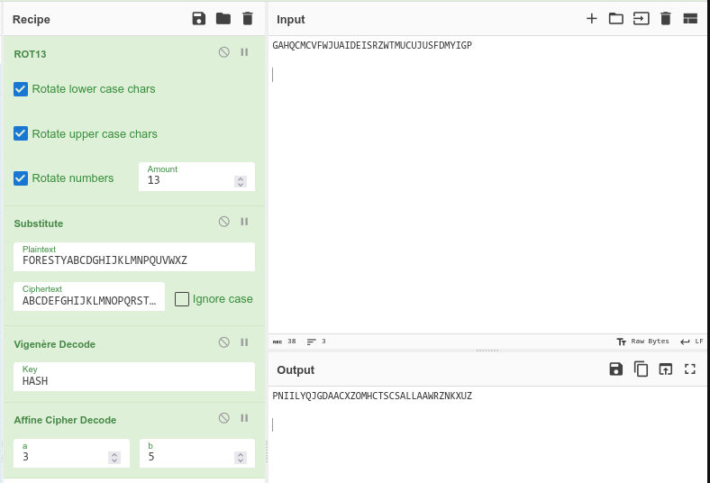
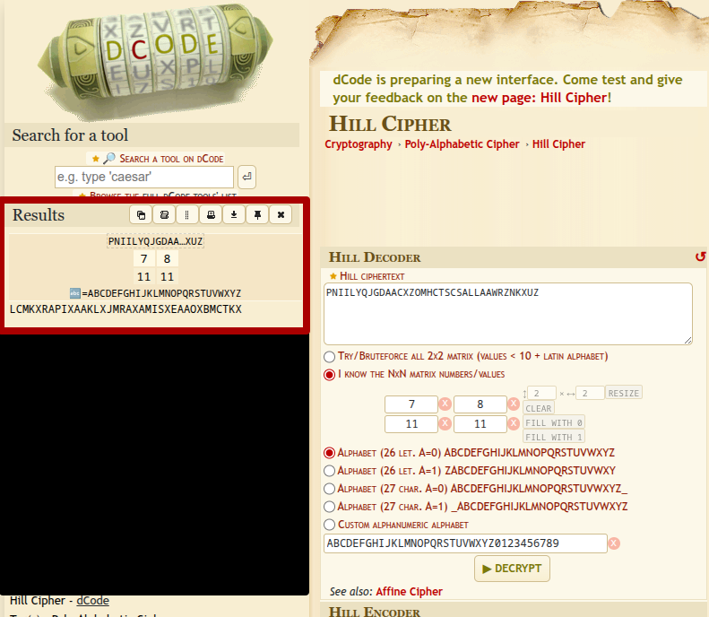
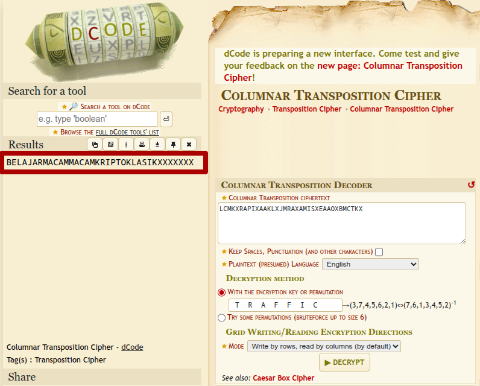

# nama
**Author:** Tuzals
**Difficulty:** medium-hard

---
## Description
FORESTY - Forensic and Security Laboratory - sedang melakukan simulasi CTF untuk calon anggota Study Group 2025. Dalam salah satu chall, sebuah pesan penting telah dikunci menggunakan enkripsi berlapis enam yang seluruhnya menggunakan teknik kriptografi klasik.

Diketahui pesan terenkripsi sebagai berikut:

GAHQCMCVFWJUAIDEISRZWTMUCUJUSFDMYIGP

## Info
Flag format: FORESTY{x_x_x_x_x}

## Hint
### hint 1
Di salah satu buku catatan lama FORESTY, kamu menemukan halaman penuh coretan tangan—jelas ditulis oleh analis senior yang pernah menggunakan metode ini bertahun-tahun lalu.

Isi halamannya berbunyi:

> “Lapisan terluar dilindungi oleh putaran alfabet kuno— tepat 13 langkah dari huruf asalnya.”

> “Di bawahnya, ada susunan huruf kustom yang dibangun dari nama laboratorium ini sendiri: FORESTY.”

> “Lapisan berikut menjaga integritas data, dijaga oleh empat huruf yang selalu dipakai saat memverifikasi berkas: HASH.”

> “Selanjutnya terdapat fungsi linier klasik, dengan pasangan nilai a = 3 dan b = 5 sebagai kuncinya.”

> “Lebih dalam lagi tersembunyi struktur kotak 2×2, berisi angka-angka: [ 7 8;  11 11 ] sebuah peninggalan dari eksperimen kriptografi lama.”

> “Dan sebelum semua lapisan itu, dasar penyandian dimulai dari penyusunan kolom, yang diatur oleh sebuah kata kunci: TRAFFIC.”

### hint 2
```
https://www.cyberacademy.id/belajar-online/classical-cryptography-for-beginner
```

## Enumeration
pada hint diketahui teknik" kriptografi apa saja yg digunakan... namun menurut sya masih belum jelas karena saya masih belum mengetahui jenis" dan karakteristik dari setiap method

kemudian hintnya saya lempar ke Ai untuk minta diberikan list" kriptografi apa yang dipakai

kemudian diketahui bahwa menggunakan teknik
1. ROT13
2. Substitution
3. Vigenere Cipher
4. Affine Cipher
5. Hill Cipher
6. Transposition

setelah diketahui itu... kita tinggal buat resepnya di cyberchef

namun saya tidak menemukan hill cipher dan transposition pada cyberchef. jadinya saya menggunakan dcode.fr untuk decode hill cipher dan transposition







## Flag 
```
FORESTY{BELAJAR_MACAM_MACAM_KRIPTO_KLASIK}
```
