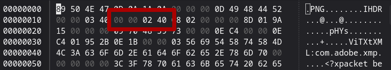

# Cropped Top
**Author:** sn0wden

**Difficulty:** Easy banget asli no fek fek

---
## Description
Tim Digital Forensics mendapatkan surat cinta dari Hengker jahat, tetapi setelah ditelusuri lebih lanjut, sepertinya file itu menyimpan sebuah rahasia, tolong bantu tim pembaik memecahkan teka-tekinya.

## Enumeration
diberikan file .pdf namun ketika dibuka muncul error ini


`unable to load image data`

ok... mungkin extensinya telah diubah... kita coba ganti extensi ke `.png`

tetap masih error... coba kita cek" lg

menggunakan exiftool ke file yg sudah diubah ke `.png` didapat info ini

```
$ exiftool chall.png
ExifTool Version Number         : 13.10
File Name                       : chall copy.png
Directory                       : .
File Size                       : 94 kB
File Modification Date/Time     : 2025:11:14 14:02:27+07:00
File Access Date/Time           : 2025:11:14 14:03:56+07:00
File Inode Change Date/Time     : 2025:11:14 14:03:56+07:00
File Permissions                : -rw-r--r--
File Type                       : PNG
File Type Extension             : png
MIME Type                       : image/png
Image Width                     : 832
Image Height                    : 576
Bit Depth                       : 8
Color Type                      : RGB
Compression                     : Deflate/Inflate
Filter                          : Adaptive
Interlace                       : Noninterlaced
Pixels Per Unit X               : 3780
Pixels Per Unit Y               : 3780
Pixel Units                     : meters
Ads Created                     : 2025-11-11
Ads Ext Id                      : a5a03e1c-2920-49ce-a055-2601b1e606a2
Ads Fb Id                       : 525265914179580
Ads Touch Type                  : 2
Title                           : square - 1
Image Size                      : 832x576
Megapixels                      : 0.479
```

```
$ pngcheck chall.png
chall copy.png  CRC error in chunk IHDR (computed 2b7691a1, expected 8d019a15)
```

terdapat info `Title: square - 1` 

kita lempar info `exiftool`, `strings`, dan judul chall `cropped top` ke ai

resultnya mengatakan bahwa kemungkinan file ini merupakan image yg ukuran awalnya square yang kemudian dicrop dengan mengedit hex... sehingga terjadi error

dia menyarankan agar mengubah hexnya langsung dan disamakan ukurannya

kita coba ubah ukuran gambarnya dari hex langsung



kita ganti yg tadinya `00 00 02 40` menjadi `00 00 03 40` agar ukurannya pandang dan lebarnya sama

## Flag 
```
FORESTY{f7ck_s0ci3t7_btw_n1c3_m4g1c_by3t3s_kn0wl3dg93}

```
