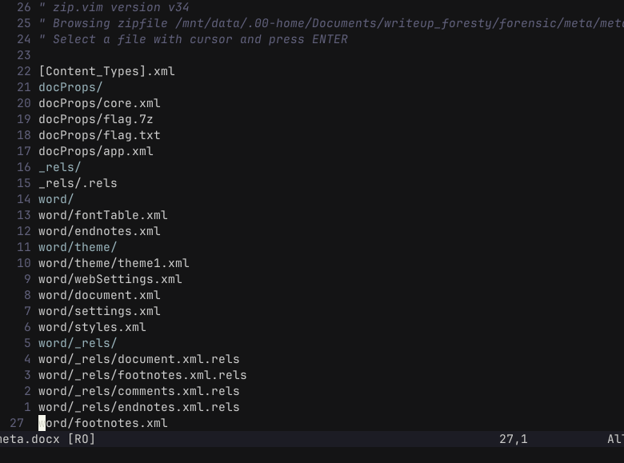
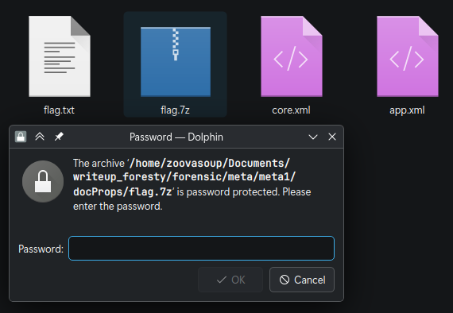
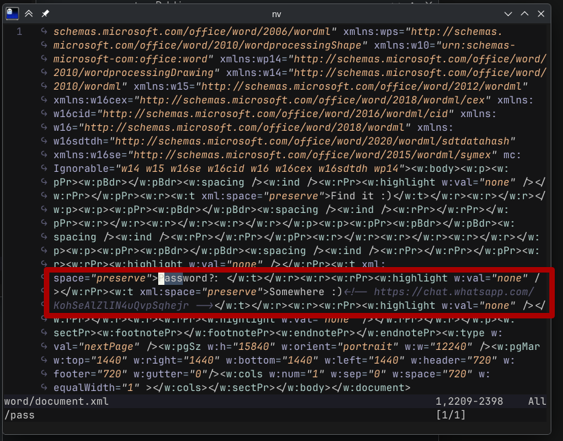

# nama
**Author:** BbayuGt
**Difficulty:** 

---
## Description
"Do you want to play a game?" - A mysterious voice echoed in your computer. You think you've been hacked. Suddenly, a file named "game.docx" appears on your desktop. You open it and find a riddle inside:

"The code is hidden in plain sight," the riddle reads.

## Enumeration
diberikan file .docx namun ketika di buka menggunakan nvim terdapat ini 



- flag.txt
- flag.7z

sya kira flagnya ada di flag.txt... ternyata...
```
Boong yahahahaah
```

emng bbayo... yaudh brarti mungkin flagnya ada di zip file

kita ganti extensinya yg tadinya `.docx` menjadi `.zip` dan di extract

setelah itu kita coba extract file `flag.7z'... dan ternyata ter enkripsi... 



yaudh kita coba cari lagi passnya 

little bit of string grep dan ditemukan ini

```
Password?: Somewhere :) <!-- https://chat.whatsapp.com/KohSeAlZlIN4uQvpSqhejr -->
```


ok.. mungkin passnya `Somewhere :)`... ternyata bukan... trus itu ada link wa di yang ter comment.. sya coba menggunakan link itu sebagai pass... ternyata benar

## Flag 
```
FORESTY{3@5y??_r1Ght?_lm0aa00a0a00}

```
