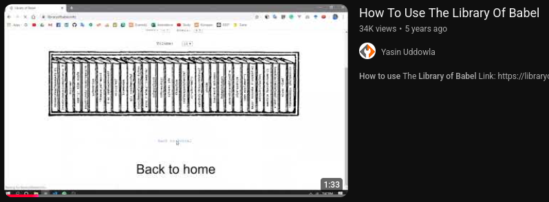
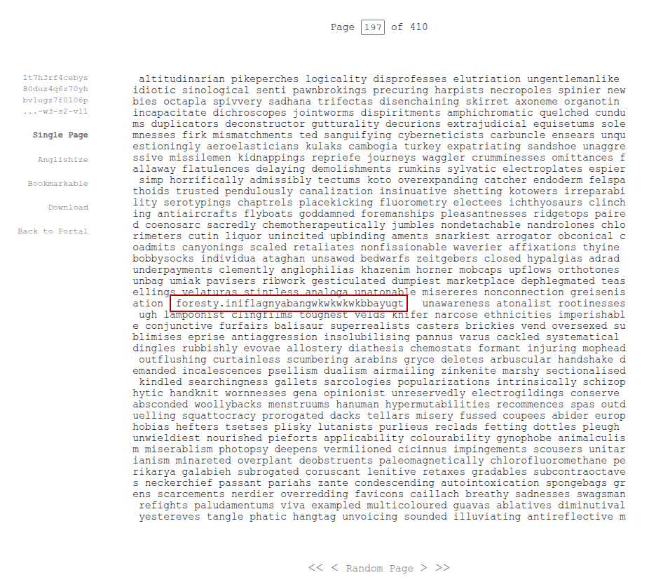

# Library in the backrooms
**Author:** Bbayugt
**Difficulty:** -

---
## Description

You stepped into the wrong hole in the ground and found yourself stuck in the Backrooms. The room looked like a library, with a hallway so full of books that you couldn't even see the end of it.

Just when you finally woke up, you found a piece of paper lying by your side. Here's what it says:

"You are awake, good. You'll be stuck here forever, unless you find a book that has the passcode so you can get out

The book is located at
```
1t7h3rf4cebys80duz4q6z70yhbv1ugz7f0106ps8sciblv6g5mbtttnvmecwvhw9p1lnekjudy16xn2zvtb4hqiwvnmpvjverb7cgnu1q3ylw71yvt8e2byoleedjey1je034yueabseitxpmu2g6a6jzv5tf1ccuhzwrcganklkj5soyi1o5ix0er4t70ggkuakbs3uvofm2raomvfmmmttuojmmcxdv4wfhtu07vjuyup4ldn9yr0n6gkstnbzo43yc9fjwom2rjkmv09vsvwwkok7frlyo3nlyw2rowkenq1b6kx394yetfcw94p2vd09wsmmclnss02lc8hnfnl7mbz549omezgt5yyp203f7ncwoee3m0ohe4ddft3o2y6oh1pnerqra9sq7y4kn1n611divaak59z1my8ozmzrjzfwmpd5ccgbij17167mkt7apx8dauxmybevk4kywnwmtv1k9fjk50ejqcea5aws7b3nh3niyl4i8zz8yjxld9nczps6cyx2zydi1v4fletkw12micuum94loco150r77jkqxuof3vbjkotbl8zzpezgqkdov0c2zyylygc7nyt3rn81bj8i9bvkng6y933p76i5g0w054uvw1gggfn6u94s8x7wl50ojeofi08amf5wl7l7w1vcmu2w2oz62rnk9yljpdzpi21gn0sulsy9e27miql3ikzsa6u0ivzzd4uhcbww2ac3mjbluej7p4tteay3nry3xnwr9xnfvls87a3btr6ja7dxige4mpj6zacumom3dhn093ya4bbqmqxr26zq5se4psgbyxlefee3ewayofxlw3eb5ozn6bdi8qzrw4vutsssh7wzail4u0o9qxyyoai50klj2aqssosqe2a2ox0tr36kxqg17mvhbsga3hxv5i23gh4bec8okwiarb1q5q2ubnnaxhn40rfy6qpckcxwauaapv78zfmnarvfuny4diknbxvf0xtsaexybq0mskpz7mqi4f97lsa177zzybgnxvbklvqtrajiif20yzd8aj257twj0hv5btr9fkp59lko2qyc4fijno0moyw2fgguzrv224eeg38bf01sqb9bc1yknlga2ozyb259cjovambfkxkwhf8kulg6k89r5kgnmmh1lm5220z9s6zsu68ma68llzsvrdvgwbe5iammdm1lm4v31gwif2hysuju9wp0oss54hs1wazqienic6f3zidydniloub12ccw33jzy4j672po6k507etg8xykceo6hpcni6eb93pv391h2dbh13j43jojoxrxg5jotkx2blz3tpw4947nc7rf9pgz3dwv9crrdzz5eqz46cja9vz8aq1mayodurznmhsfw7ushvoe7f0mvla6zkrb8v8c4d8b3sks9w25otj36zv38wbg14fow874o76ofm1baw2xh1e7jutxs0ybgyijj9u6fgroxo9ytpf27wsuvajvbiqsr55vgi5zz5lk38suu8i7q638yn26kc9yfqu0afafeai2b2fjf6fkaxfh8d1u46r9ehabr7o1wou9zwvdndg3tkbz1s2d6tw2k1h06hy10o1j4pmp8qm4uz8u1e5pypvwk5gcnocklwyn3mpmnbfg31l9cobbysfrqzmojoi9pej5x250l03lih2bb8xt6cjpjy3cjphm60qlgt400v40u4nsn52lndvpesaol73f56icga6faemoyksqq0nebxir4vyfa5tlt20h8jcto8qa63k6dpi3pw402rxlg209do8xpyqoxbhqsr4xlc5kdh9q0mvxge4drci2kpmogobfsqd34v736n8y294pexqg3b9n2feu0lnd8xifuxliawbsjg8hu2u30xhvs6fr6puqhpr967st944rvtr08a1ilel297nkq5ian9xmushiumvp1cwfojtbhyk3gmff2rja6i769xurqzhj41c4kr7ygjwigrt3976pqlvgj3mw3qotg1r8kmcio0kip9deifxngs1osujpxoubje70kfk3qxcfesaps5y3tofdlp0nh7gpp693r3q2129suek4uh01my03u92k7kyikjukypl9rlhkktaee6mprpqjqzasfw0ffhrd8wfx43fmsvgdxvwz7jv8gqejhzttwemk03ezemamdnp2melu82l6orz2ujupzdc5ae3edu103kmdqql25yikbwwomn9de3h20unmw36crl7p8ekxov8qaqjhp1x5vtmmbt8bo27yu26556aqakmjhm17k2pe3shv5a9upl43bwmqold43iw26w4a12jn5nntxddu5vj1ssrehcfz6bxoum1wynlgv66j1hm6iybta8zmp8v3tt9vmy88oj6cfl8zvclkmpngq80t0ud2ci7nm2qa21z7li0wptvweawu4wiz97t1v55nt15sd9hm99jby0ys93i2qcfh85uhu2z4q5bu2fc0gqecmqc609xx59ur1smns1b8zc5lxj8ekyjwas1wc7j0xhp8dtuxx71v3e4m9wy8cuinjr4nrengkn7ksxbynuubby83cb3mtg59av1ojlloei00ve2r98jqhmv1f5eyo08m8r1vyhw61wayg9uiiu2kh5h70af7ge4yecf2r3cb9tm9wozu26zyha73wsndh785m9imigsiunuhhnd43qaotw4mr8ccys0wse6pn6jzozj8tw81yro682a1zir1y25p940hhn6jh2rw28c42my8nqyz3jua1bqzb9yc2b6f0zfwj8j1ng9oerpf0ewgtf6ammezqvtdopyqe1c2leuge8xofq24zb57vzpqbwis2c2sax9oj2mtd7bn6yekeauwgqx3wk9o6ysxy891tnh7aojjwvw8lks9k3p2cj9whlmdiqrotl4w9opv6d5kpfwhpy08o9g16l5nh78axxf0mzfka85z8733p76cd5pwc4ays3v4f82oanfdws4ogo1uet1w047gegdquhqf52vpf3aqu3gewccaub8j4d91tppwa0zadf9as373l7l5w88bv0bbygs1qxonof5xsao0m3lknzbs2jcmvsk3jrx36dhw7m21xtof2b3ucy4inpf4tpb1wpgppi3cfbrzkfoqiujkhve1k74tm7ri383d6b0ilhsm70unve6pipn934ccjt2szxvp3r589dvevs3c68wuda0ccelaka1535mgyk9vhaoj5y3fc

```
Expand

at walls 3, shelf 2.

the title should be ya,gezorzzgaoc,mpgogdesli volume 11 It should be at page 197"

Can you find the book and read what it says?

## Info
- Format flag : FORESTY{flag.text}
- Unrelated link: https://en.wiktionary.org/wiki/babel

## Enumeration
>little bit of Ai and i got this info


then i search how to use [https://libraryofbabel.info/](https://libraryofbabel.info)



after that just follow the instruction.



## Flag 
```
FORESTY{foresty.iniflagnyabangwkwkwkwkbbayugt}
```
