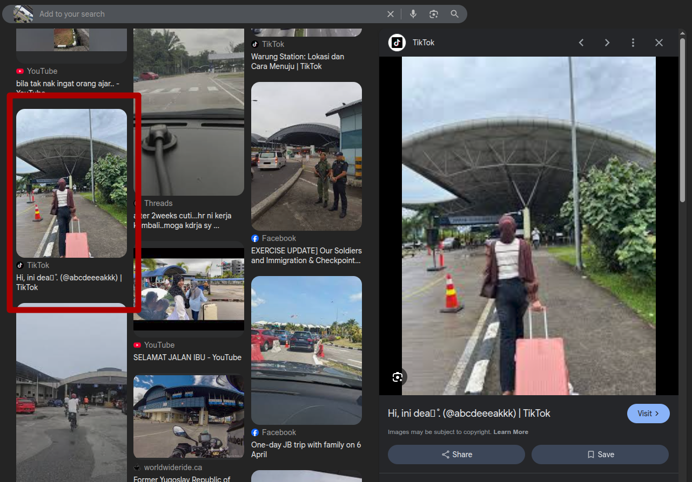

# nama
**Author:** BBayuGt
**Difficulty:** Easy

---
## Description
Atmin kemana sih gajelas banget

Gunakan plus code Google

Contoh

FORESTY{2JJH+77 Sukapura, Kabupaten Bandung, Jawa Barat}

FORESTY{2JJH+77} juga bisa

NOTE: Gunakan plus code pada struktur terdekat dari tempat Atmin mengambil foto (Contoh: Gedung, menara, mall, yang ada di label di Google)!

## Info


## Enumeration
lihat" hasil google reverse image, terdapat 1 foto yg menarik.... terlihat bentuk atapnya mirip seperti yang ada di chall

melihat konten" yang ada.... banyak yg memention jambi... jadi saya asumsi itu ada di jambi

dari situ kita cari bandara yang ada di jambi... didapatkan bandara sultan thaha 

kemudian tinggal buka street view dan cari titik dimana atmin mengambil gambar




## Flag 
```
FORESTY{9J9V+F2M, Talang Bakung, Jambi Selatan, Jambi City, Jambi 36127}
```
