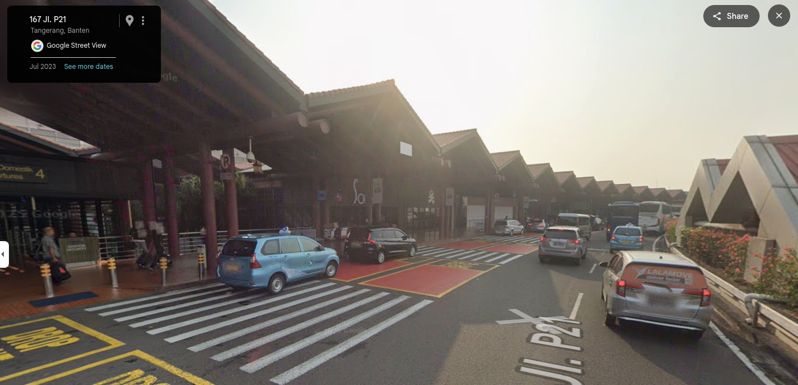
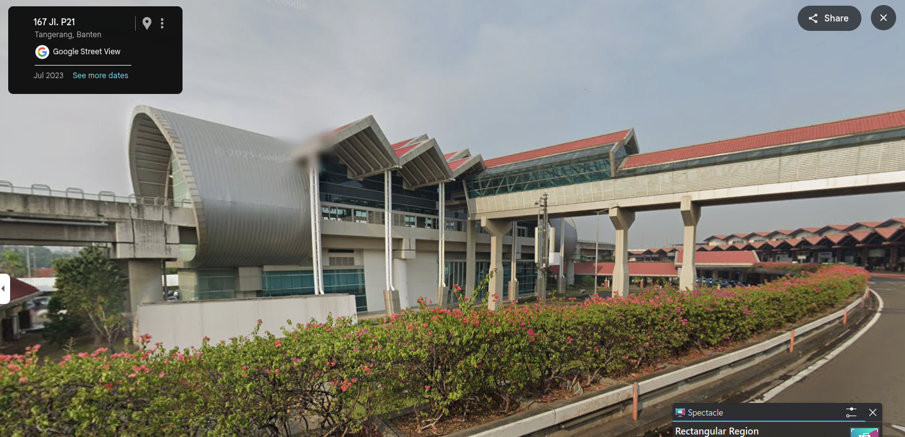
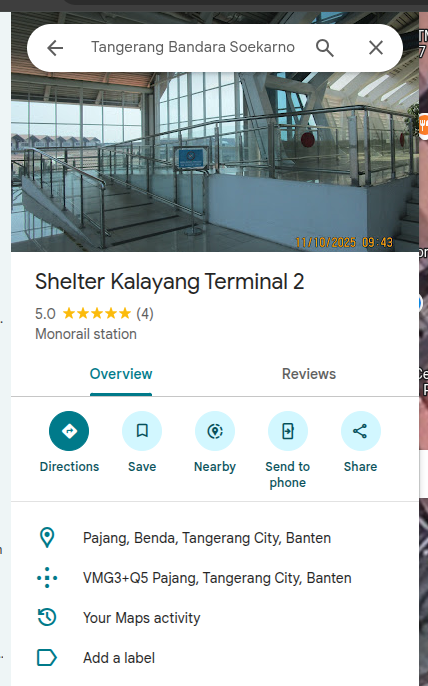

# Atmin
**Author:** BBayuGt

**Difficulty:** Easy-Medium

---
## Description
Atmin dimana wok

Gunakan plus code google Contoh:
```
FORESTY{2JJH+77 Sukapura, Kabupaten Bandung, Jawa Barat}

FORESTY{2JJH+77}
```

:3

## Info


## Enumeration
google reverse image search memberitahu bahwa kira" ada di stasiun bandara sukarno-hatta dan ketika dilihat di google maps bentukan atapnya mirip dengan yg ada di chall


kemudian dari gambar attachment diketahui:
- arah ke 4B
- solaria luar
- posisi atas

muter-muter google street pada soekarno-hatta 4B sampe ketemu solaria 
ketika sudah ketemu solaria kita tinggal tarik perspektif seperti pada attachment







## Flag 
```
FORESTY{VMG3+Q5 Pajang, Tangerang City, Banten}
```
